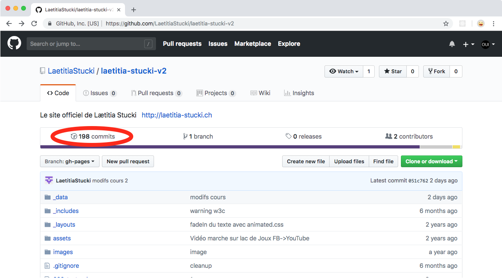
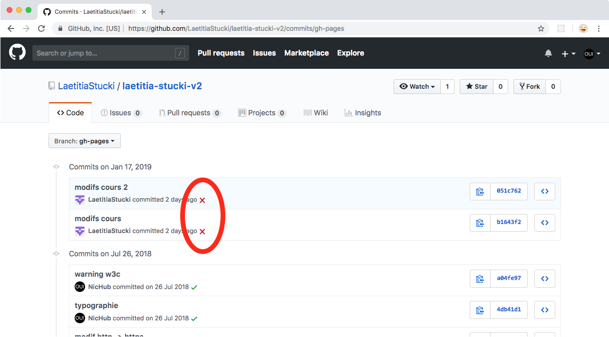
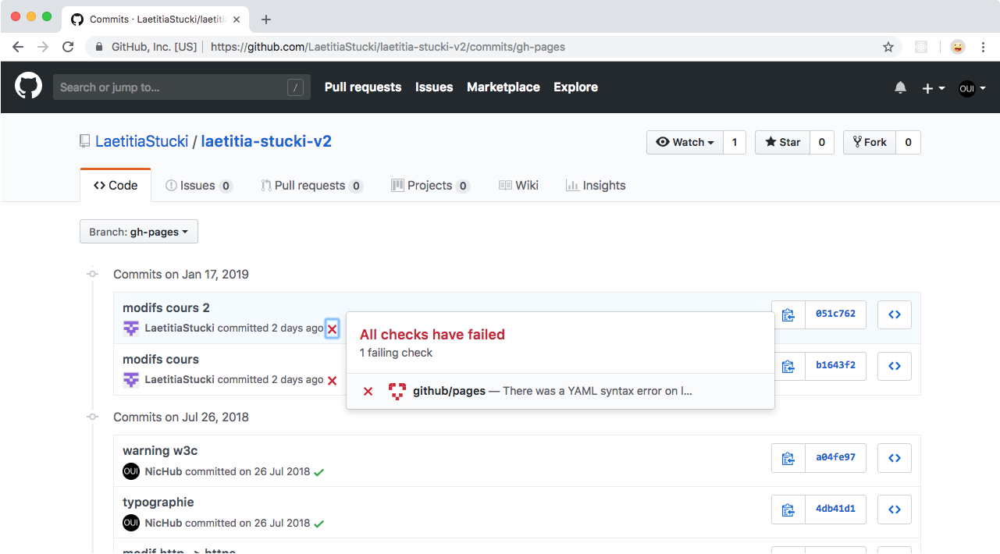
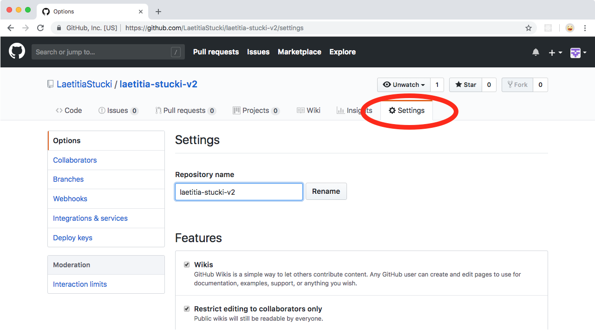
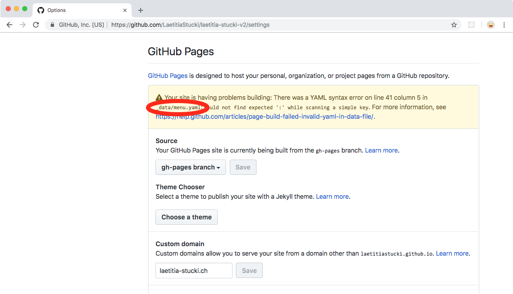
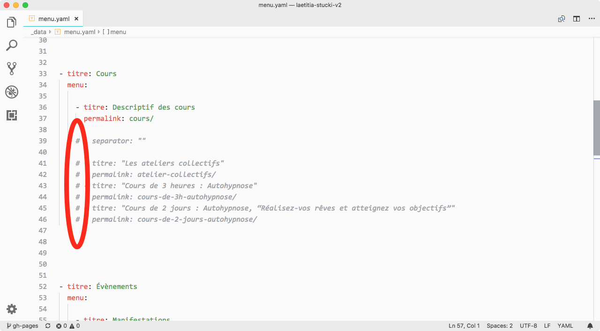

# Debug GitHub pages

Pour <https://laetitia-stucki.ch/>
Aller à <https://github.com/LaetitiaStucki/laetitia-stucki-v2>

Pour <https://sacree-sexualite.org/>
Aller à <https://github.com/LaetitiaStucki/sacree-sexualite-v2>

---

Cliquer sur le nombre de commits en haut à gauche.

---

Si le ou les derniers commits ont une croix rouge, c’est pas bon signe.

---

On peut cliquer sur la croix rouge pour avoir un résumé de l’erreur.

---

Mais pour obtenir plus de détails, il faut aller dans l’onglet *Settings* en haut à droite. **Il faut être connecté pour que cet onglet apparaisse.**

---

Et plus bas sur la page *Settings*, il y a une description un peu plus détaillée. Dans ce cas on voit que le problème vient du fichier `_data/menu.yaml`.

---

Pour corriger le problème il faut remplacer les marques de commentaire HTML (`<!-- -->`) par des marques de commentaire YAML (`# `) dans le fichier `_data/menu.yaml`.

